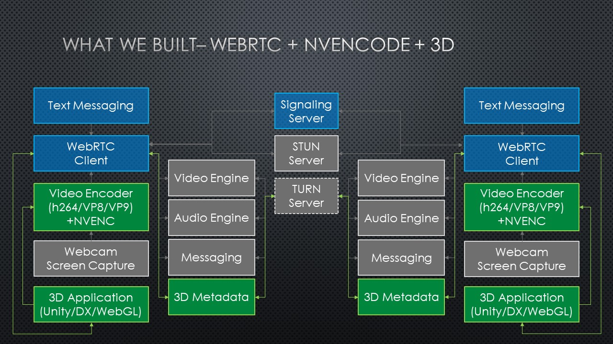

# 3D Toolkit :muscle: :eye: :cloud:

A toolkit for creating powerful cloud-based 3D experiences that stream to traditionally out of reach low-powered devices. 

## What is this?

**Problem:** The world is becoming increasingly mobile, but the demand for high-fidelity 3D content is only growing. We needed a scalable approach to make this sort of content available on low-powered, low-bandwidth devices.

The 3DToolkit project's purpose is to provide an approach for developing 3D server applications that stream frames to other devices over the network. Specifically:

1. Server-side libraries for remotely rendering 3D scenes
2. Client-side libraries for receiving streamed 3D scenes
3. Low-latency audio and video streams using WebRTC
4. High-performance video encoding and decoding using NVEncode

<!---  ()--->

Here's a high-level diagram of the components we've built (in green), and how they interact with the underlying WebRTC and NVEncode technologies we've leveraged. For a full description, check out [our wiki page on WebRTC](https://github.com/CatalystCode/3dtoolkit/wiki/What-is-3DToolkit#webrtc-httpwebrtcorg). 

## How to build

> If you don't wish to build the toolkit yourself, you can download our latest build [here](https://github.com/CatalystCode/3dtoolkit/releases/latest).

These steps will ensure your development environment is configured properly, and then they'll walk you through the process of building our code.

### Prerequisites 

> Note: If you are using Visual Studio 2017, ensure you have installed the Visual Studio 2015 Update 3 as well, and please **_do not_** update our projects when prompted to do so.

+ Windows 10 Anniversary Update / Windows Server 2012 R2 / Windows Server 2016 (see [which version of Windows you have](https://binged.it/2xgQqRI)) 
+ [Visual Studio 2015 Update 3](https://www.visualstudio.com/en-us/news/releasenotes/vs2015-update3-vs)
+ [Windows 10 SDK - 10.0.14393.795](https://developer.microsoft.com/en-us/windows/downloads/sdk-archive)
+ [Latest NVIDIA driver](http://www.nvidia.com/Download/index.aspx) (required for NVEncode)
+ [Azure SDK 3.0.1](https://www.microsoft.com/web/handlers/webpi.ashx/getinstaller/VWDOrVs2015AzurePack.appids) for Visual Studio 2015 (Optional, but required to use the Server Azure Deployment projects)

### Installing dependencies

> Note: Before running our `setup.cmd` script, please ensure powershell is set to [enable unrestricted script execution](https://docs.microsoft.com/en-us/powershell/module/microsoft.powershell.core/about/about_execution_policies?view=powershell-5.1&viewFallbackFrom=powershell-Microsoft.PowerShell.Core).

Run `.\setup.cmd` from the command line. This will install and configure the following:

+ 32bit and 64bit Debug, Release, Exes, Dlls and PDBs from this commit [Chromium m58 release](https://chromium.googlesource.com/chromium/src/+/2b7c19d3)
+ [WebRTC patch](./Libraries/WebRTC/3dtoolkit_upgrades.patch) and [WebRTC third_party patch](./Libraries/WebRTC/third_party_nvpipe.patch), which adds nvencode support, frame prediction, video frame updates and native buffers to webrtc. These will be applied to the above
+ Pre-built [NvPipe library](https://github.com/anderm/NvPipe/tree/low-latency-optimization) used in our WebRTC patch to enable NVIDIA-accelerated zero latency video compression
+ [CUDA Toolkit 9.1](https://developer.nvidia.com/cuda-downloads) pre-built Release libraries used by NvPipe - cudart64_91 and nvToolsExt64_1
+ 32bit and 64bit Debug and Release libraries for DirectX Toolkit 
+ Release libraries for OpenGL - Freeglut, Glew and glext
+ [WebRTC-UWP](https://github.com/anderm/webrtc-uwp-sdk/tree/media-stream-source) M58 synced release for UWP-based clients (Hololens)

Once you see `Libraries retrieved and up to date` you may proceed.

### The actual build

+ Open [the 3dtoolkit solution](./3DStreamingToolKit.sln) in Visual Studio
+ Build the solution (Build -> Build Solution) in the desired configuration (Build -> Configuration Manager -> Dropdowns at the top). We encourage using  `Release` and `x64`.
+ Done!
> Note: We no longer support x86 server builds that are using nvencode. This is due to 32-bit support gradually being deprecated/removed from CUDA. 

If you're seeing errors, check out the [troubleshooting guide](https://github.com/CatalystCode/3dtoolkit/wiki/FAQ) and then [file an issue](https://github.com/catalystcode/3dtoolkit/issues/new).

## Build output

After you've built the solution, you'll likely want to start one sample server implementation, and one sample client implementation. We've provided example client and server applications to demonstrate the behaviors the toolkit provides.

> Note: We advise you to try `Spinning Cube` and `StreamingDirectxClient` to begin, as these are the simpliest sample implementations.

To run one server and one client, navigate to the location under `Build\<Platform>\<Configuration>\` and start the `exe`.To identify what `<Platform>` and `<Configuration>` are, see your desired configuration from [section: the actual build](#the-actual-build). Recall the note encourages using  `Release` and `x64`.

Once you start both a server and client implementation, you will need to give it a signaling server. If you need to set one up, please see our [wiki on Signaling Service](https://github.com/CatalystCode/3dtoolkit/wiki/Signaling-Service) for an easy local or cloud-based implementation. After connecting, you should be seeing success! If you're instead seeing errors, check out the [Troubleshooting guide](https://github.com/CatalystCode/3dtoolkit/wiki/FAQ) and then [file an issue](https://github.com/catalystcode/3dtoolkit/issues/new). Additionally, you can see more information about our other sample implementations [here](https://github.com/CatalystCode/3dtoolkit/wiki/Feature-matrices).

## Next Steps

These resources will be critical to your success in configuring and scaling applications.

+ [Sample implementation configuration files](https://github.com/CatalystCode/3dtoolkit/wiki/JSON-Config-Files)
+ [Configuring and deploying services](https://github.com/CatalystCode/3dtoolkit/wiki#services-setup)
+ [Configuring authentication](https://github.com/CatalystCode/3dtoolkit/wiki/Configuring-authentication)

## Learn More

+ [General Wiki](https://github.com/CatalystCode/3dtoolkit/wiki)
+ [Building WebRTC from source](https://github.com/CatalystCode/3dtoolkit/wiki/Building-WebRTC-from-source)
+ [WebRTC Homepage](https://webrtc.org/)
+ [NVEncode Homepage](https://developer.nvidia.com/nvidia-video-codec-sdk)
+ [NvPipe original source](https://github.com/NVIDIA/NvPipe)

## License

MIT

### License Considerations

# !IMPORTANT - USING UNITY AS A 3D VIDEO STREAMING SERVER IS AGAINST THE SOFTWARE TERMS OF SERVICE - THE UNITY SERVER SAMPLE IS PROVIDED FOR DEMO AND EDUCATIONAL PURPOSES ONLY.  CONTACT UNITY FOR LICENSING IF YOU WANT TO USE THE UNITY SERVER SAMPLE IN ANY COMMERCIAL ENVIRONMENT

## Please refer to https://unity3d.com/legal/terms-of-service/software 

> ### Streaming and Cloud Gaming Restrictions

> You may not directly or indirectly distribute Your Project Content by means of streaming or broadcasting where Your Project Content is primarily executed on a server and transmitted as a video stream or via low level graphics render commands over the open Internet to end user devices without a separate license from Unity. This restriction does not prevent end users from remotely accessing Your Project Content from an end user device that is running on another end user device.
