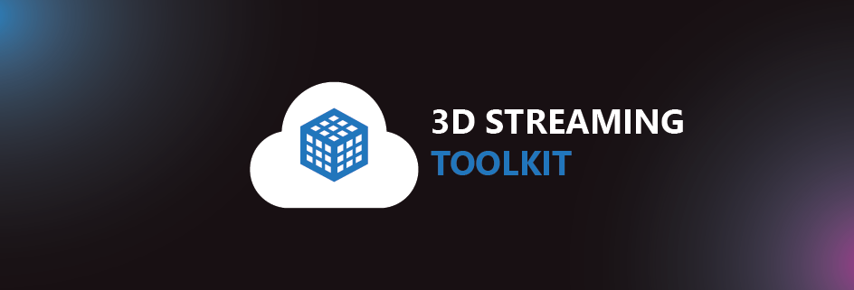

# 3D Streaming Toolkit :muscle: :eye: :cloud:

A toolkit for creating powerful cloud-based 3D experiences that stream to traditionally out of reach low-powered devices. 

## Quick Links

- [Getting Started](#getting-started)
- [Contributing](#contributing)
- [License](#license)
- [Code of Conduct](#code-of-conduct)

## What is this?

**Problem:** The world is becoming increasingly mobile, but the demand for high-fidelity 3D content is only growing. We needed a scalable approach to make this sort of content available on low-powered, low-bandwidth devices.

The 3DStreamingToolkit project’s purpose is to provide an approach for developing 3D server applications that stream frames in real-time to other devices over the network. Specifically:

* A server-side C++ plugin and samples for remotely rendering and streaming 3D scenes
* Cross-platform client-side samples for receiving streamed 3D scenes, including HoloLens
* Cloud infrastructure architecture to allow large-scale deployment
* Zero latency video compression using NvPipe/NVEncode
* WebRTC extensions for 3D content and input

## Getting Started

Check our [main documentation website](https://3dstreamingtoolkit.github.io/docs-3dstk/) for information on how to get started, reference architecture and tutorials.  

## Contributing

Read our [contributing guide](./CONTRIBUTING.md) to learn about our development process, how to propose bug fixes and improvements, and how to build and test your changes.

## License

MIT

### License Considerations

# !IMPORTANT - USING UNITY AS A 3D VIDEO STREAMING SERVER IS AGAINST THE SOFTWARE TERMS OF SERVICE - THE UNITY SERVER SAMPLE IS PROVIDED FOR DEMO AND EDUCATIONAL PURPOSES ONLY.  CONTACT UNITY FOR LICENSING IF YOU WANT TO USE THE UNITY SERVER SAMPLE IN ANY COMMERCIAL ENVIRONMENT

## Please refer to https://unity3d.com/legal/terms-of-service/software 

> ### Streaming and Cloud Gaming Restrictions

> You may not directly or indirectly distribute Your Project Content by means of streaming or broadcasting where Your Project Content is primarily executed on a server and transmitted as a video stream or via low level graphics render commands over the open Internet to end user devices without a separate license from Unity. This restriction does not prevent end users from remotely accessing Your Project Content from an end user device that is running on another end user device.

## Code of Conduct

This project has adopted the [Microsoft Open Source Code of Conduct](https://opensource.microsoft.com/codeofconduct/). For more information see the [Code of Conduct FAQ](https://opensource.microsoft.com/codeofconduct/faq/) or contact [opencode@microsoft.com](mailto:opencode@microsoft.com) with any additional questions or comments.
